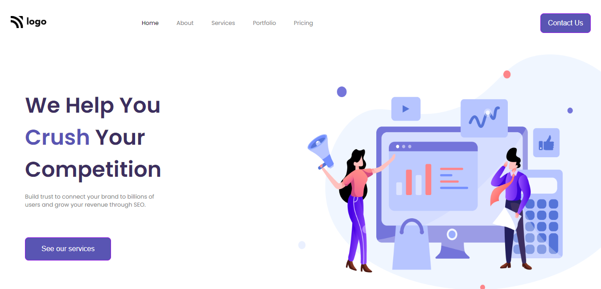

# Hi , My name is vimal kumar.

## This is Fourth web page i have created.
It took me 4 hours to complete. 
### I have learnt following things while creating this project.
1. Css positions
2. Borders
3. Buttons
4. svg Images
5. Flexbox

  ##### [Click here to view live project](https://seowebsites.netlify.app/ "click here to view page")